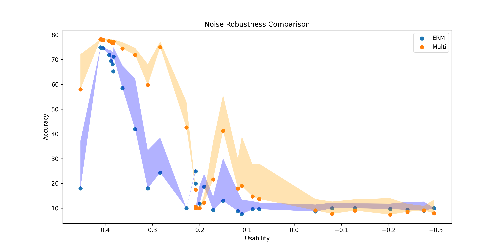

# BayesMulti: A Baysian Fault Tolerance Neural Network Searching Algorithm Designed for Memristor-based Neuromorphic Computing

## Introduction

In this repository, we provides with a state-of-the-art methodology to handle the memristor noise problem, so that facilitate the promising further development of Memristor-based Neuromorphic Computing. 

Our method is known by a novel noise-robust neural network searching method and outperforms up to 100 times than the ERM (refers to Empirical Risk Minimization, in our context) models. 

More details can be found in our paper.

## The Structure of this Repository

```
---Root
 |--configs
 | |-config_Alexnet_cifar10_erm.py
 | |-config_Alexnet_cifar10_multi.py
 |--data_loaders
 | |--dataset
 | | |-MNIST
 | | |-FashionMNIST
 | | |-cifar10
 | | |-...
 | |--dataloader_*.py
 |--models
 | |--Alexnet_cifar10.py
 | |--twolayerMLP_mnist.py
 | |--...
 | |--multinomial.py
 |--hardware_noise
 | |--weight_mapping.py
 | |--hardware_data
 |   |-data1.xlsx
 |   |-data2.xlsx
 |   |-...
 |--utils
 | |--train_utils.py
 | |--common_utils.py
 |--saved_ckpts
 | |--ckpt1.pth
 | |--ckpt2.pth
 | |--...
 |--experiments
   |--train_Alexnet_cifar10_multi.py
   |--train_Alexnet_cifar10_erm.py
   |--test_Alexnet_cifar10.py
```

In this repository, each sub directory are explained by:

| Sub Dir Name   | Explanation                                                                                                                                                                  |
| -------------- | ---------------------------------------------------------------------------------------------------------------------------------------------------------------------------- |
| configs        | The config file which determine each experiments' hyper-parameters settings.                                                                                                 |
| experiments    | The codes for highest-level APIs of experiments in our paper. Each experiment is entitled by its model and dataset used.                                                     |
| dataloaders    | This is an API designed for loading and managing different datsets uniformly.                                                                                                |
| models         | This is where we define different versions of models (ERM, BayesFT, or Multinomial BayesFT), as well as an API designed for loading and managing different models uniformly. |
| utils          | The indispensable utils to support training, testing and data-loading while keep the main code logic neat and clear.                                                         |
| saved_ckpts    | Check points of model weights saved for easy problem checking, continuous training, and fast verification.                                                                   |
| hardware_noise | The processing and analysis of real memristor Current-Volta cycle data, where the noise character are modeled by a MLE method.                                               |

## Environment

```
OS: Ubuntu 23.10
# Name                    Version                   Build  Channel
nvidia-cuda-nvrtc-cu11    11.7.99                  pypi_0    pypi
nvidia-cuda-runtime-cu11  11.7.99                  pypi_0    pypi
torch                     1.13.1                   pypi_0    pypi
torchaudio                0.13.1                   pypi_0    pypi
torchvision               0.14.1                   pypi_0    pypi
```

## Get Started

```
# install all the requirements
pip install -r requirments.txt
```

## Use Cases

Given the `Cifar-10` dataset (Krizhevsky et al., 2012) and `AlexNet` model (Krizhevsky, A., 2009) as an example, we can demonstrate the effectness of our method simply by following the subsequent steps:

### Train an ERM Model

As for training an ERM model, it is the ordinary way we train a neiral network. You can simply run the following command:

```
python ./experiments/train_Alexnet_cifar10_erm.py --weight_save_path ./saved_ckpts/Alexnet_cifar10_erm.pth --num_epochs_Adam 40
```

In this example, the script will load the model, train it on CIFAR10 dataset, and save the model weights.

### Train a Multinomial Fault Tolerance Model

The training for a Multinomial Fault Tolerance Model involves with a Bayesian Optimisation (Nogueira, F., 2014)) and in each Bayesian Optimization the model is initialised and then trained for certain epochs. With the Bayesian Optimisation going, the dropout rate is optimised so that the better noise-robust network architecture is found. 

Run the following code in your shell:

```
python ./experiments/train_Alexnet_cifar10_multi.py --weight_save_path ./saved_ckpts/cnn_multi.pth --num_epochs_Adam 40 --num_iters_Bayes 10 --num_init_points 3 --random_seed 666 --verbose_Bayes 2

# Parameters:
--weight_save_path: Path to save the trained model weights.
--num_epochs_Adam: Number of epochs for training with Adam optimizer (default: 40).
--num_iters_Bayes: Number of iterations for Bayesian Optimization (default: 10).
--num_init_points: Number of initial points for Bayesian Optimization (default: 2).
--random_seed: Random seed for reproducibility (default: 666).
--verbose_Bayes: Verbose level for Bayesian Optimization (0, 1, 2).
```

### Test the noise robustness of both ERM and Multinomial Moddels

For simplicity, by default you can directly run:

```
python ./experiments/test_Alexnet_cifar10.py
```

where the script `./experiments/test_Alexnet_cifar10.py` tests the noise robustness of different models by evaluating their performance with added hardware noise. It also processes and plots the results to visualize the robustness of each model. 



In the following your can find a more detailed general template for parameter settin:  

```{Shell}
python test_noise_robustness.py --weight_path_erm path/to/your/cnn_erm.pth --weight_path_multi path/to/your/cnn_multi.pth --noise_file_dir ./hardware_noise/hardware_data/ --file2sigma_dir ./hardware_noise/file2sigma.npy --file2usability_dir ./hardware_noise/file2usability.npy --N_trials 10 --seed 666 --img_save_path ./tools/saved_imgs/noise_robustness.png

# Parameters:
--weight_path_erm: Path to the weights of the ERM model.
--weight_path_multi: Path to the weights of the Multinomial model.
--noise_file_dir: Directory containing hardware noise files.
--file2sigma_dir: Path to the numpy file mapping files to sigma values.
--file2usability_dir: Path to the numpy file mapping files to usability values.
--N_trials: Number of trials for each noise file (default: 10).
--seed: Random seed for reproducibility (default: 666).
--img_save_path: Path to save the output plot image.
```

## References

Krizhevsky, A. (2009) 'Learning Multiple Layers of Features from Tiny Images', available at: https://www.cs.toronto.edu/~kriz/learning-features-2009-TR.pdf (Accessed: 28 May 2024).

Nogueira, F. (2014) 'Bayesian Optimization: Open source constrained global optimization tool for Python', available at: https://github.com/bayesian-optimization/BayesianOptimization (Accessed: 28 May 2024).

Krizhevsky, A., Sutskever, I. and Hinton, G.E. (2012) 'ImageNet Classification with Deep Convolutional Neural Networks', Advances in Neural Information Processing Systems, 25, pp. 1097-1105, available at: https://papers.nips.cc/paper/4824-imagenet-classification-with-deep-convolutional-neural-networks.pdf (Accessed: 28 May 2024).

Duan, X., Cao, Z., Gao, K., Yan, W., Sun, S., Zhou, G., Wu, Z., Ren, F. and Sun, B., 2024. Memristor‐Based Neuromorphic Chips. Advanced materials, p.2310704.

## Cite this repository

If you find this repository helpful, please cite it by:

@misc{BayesMulti2024,
  author = {Qiao Sun},
  title = {BayesMulti: A Bayesian Fault Tolerance Neural Network Searching Algorithm Designed for Memristor-based Neuromorphic Computing},
  year = {2024},
  howpublished = {\url{https://github.com/qiaosun22/BayesMulti}},
  note = {Accessed: 28 May 2024}
}
# BayesMulti
